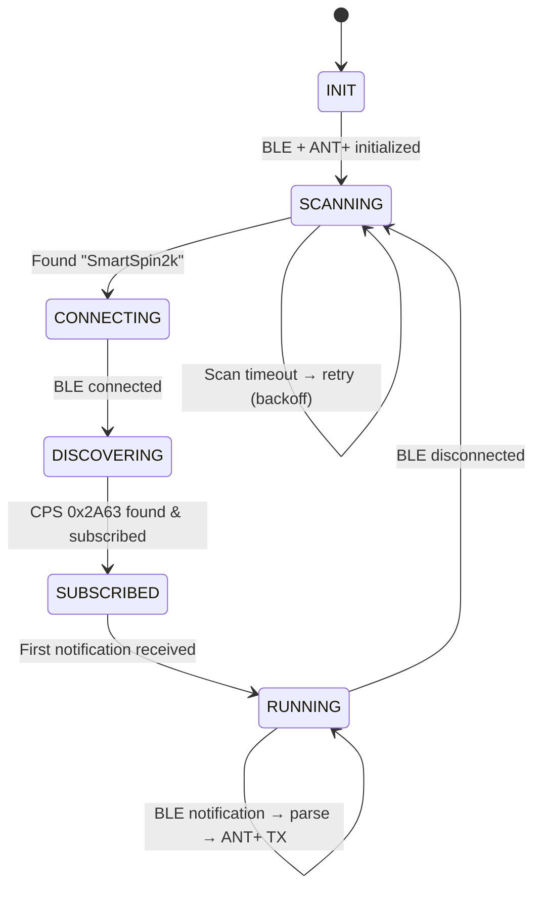

# Architecture — BLE-to-ANT+ Data Flow

## Protocol Specifications

### BLE Input: Cycling Power Measurement (0x2A63)

The SmartSpin2k advertises as `"SmartSpin2k"` and exposes CPS service 0x1818.
The Cycling Power Measurement characteristic (0x2A63) sends notifications with this format:

```
Byte 0-1: Flags (uint16, little-endian)
  ├── Bit 0: Pedal Power Balance Present
  ├── Bit 1: Pedal Power Balance Reference  
  ├── Bit 2: Accumulated Torque Present
  ├── Bit 3: Accumulated Torque Source
  ├── Bit 4: Wheel Revolution Data Present
  ├── Bit 5: Crank Revolution Data Present   ← IMPORTANT for cadence
  ├── Bit 6: Extreme Force Magnitudes Present
  ├── Bit 7: Extreme Torque Magnitudes Present
  └── Bits 8-15: Other optional fields

Byte 2-3: Instantaneous Power (sint16, Watts) — ALWAYS PRESENT

If Bit 5 (Crank Revolution Data Present) is set:
  Byte N+0 to N+1: Cumulative Crank Revolutions (uint16)
  Byte N+2 to N+3: Last Crank Event Time (uint16, units: 1/1024 second, rolls over at 64s)
```

**Cadence Calculation:**
```
deltaRevs = currentCrankRevs - previousCrankRevs  // handle uint16 rollover
deltaTime = currentCrankTime - previousCrankTime   // handle uint16 rollover
cadenceRPM = (deltaRevs * 60 * 1024) / deltaTime
```

**SmartSpin2k CPS format (verified from live device):**
The SmartSpin2k sends `flags = 0x0030` — **both bit 4 (Wheel Revolution Data) and bit 5 (Crank Revolution Data) set** — producing a 14-byte packet:

```
Byte 0-1:  Flags = 0x0030 (uint16 LE)
Byte 2-3:  Instantaneous Power (sint16 W)        ← e.g. 0x00AD = 173 W
Byte 4-7:  Cumulative Wheel Revolutions (uint32)  ← bit 4 block: 6 bytes total
Byte 8-9:  Last Wheel Event Time (uint16, 1/2048s)
Byte 10-11: Cumulative Crank Revolutions (uint16) ← bit 5 block: 4 bytes total
Byte 12-13: Last Crank Event Time (uint16, 1/1024s)
```

**Critical parser note:** Because bit 4 is always set, the crank data is never at a fixed
offset. The parser must walk optional fields in flag-bit order and skip the 6-byte wheel
block before reading crank data. See `ble_ant_bridge.ino:cpmNotifyCallback` for the
implemented offset walk (bits 0, 2, 4 each advance the offset before reaching bit 5).

### FTMS Input: Indoor Bike Data (0x2AD2) — ROADMAP

For future implementation. The SmartSpin2k also exposes FTMS service 0x1826.

```
Byte 0-1: Flags (uint16, little-endian)
  ├── Bit 0: More Data (INVERTED: 0 = instantaneous speed present)
  ├── Bit 1: Average Speed Present
  ├── Bit 2: Instantaneous Cadence Present
  ├── Bit 3: Average Cadence Present
  ├── Bit 4: Total Distance Present
  ├── Bit 5: Resistance Level Present
  ├── Bit 6: Instantaneous Power Present     ← Key field
  ├── Bit 7: Average Power Present
  └── Bits 8-12: Energy, HR, etc.

Fields appear IN ORDER based on set flag bits:
  - Instantaneous Speed: uint16, resolution 0.01 km/h
  - Instantaneous Cadence: uint16, resolution 0.5 RPM
  - Instantaneous Power: sint16, Watts
```

### ANT+ Output: FE-C — Fitness Equipment Control (Device Type 0x11) ← CURRENT

The bridge transmits the ANT+ **FE-C** profile so Garmin pairs the SmartSpin2k as a
controllable smart trainer (not a bare power sensor). FE-C trainer page 25 already
carries power + cadence, so it fully supersedes the BPWR output below.

#### Channel Configuration
```
Channel Type:       Bidirectional Master (0x10)   ← NOT TX-only; needed for control RX
Network Number:     0 (ANT+ public network)
Network Key:        ANT_PLUS_NETWORK_KEY (supplied at build time — not in repo)
RF Frequency:       57 (2457 MHz)
Channel Period:     8192 (exactly 4.00 Hz, 0x2000)
Device Type:        0x11 (Fitness Equipment)
Transmission Type:  0x05
Device Number:      NRF_FICR->DEVICEID[0] & 0xFFFF
```
The channel is a **bidirectional** master (0x10), unlike the BPWR build's
`MASTER_TX_ONLY` (0x50): FE-C must receive Garmin's acknowledged control pages, so
the RX guard band after each TX is required (a small coexistence cost vs. BLE). One
channel is still the S340 default, so `sd_ant_enable()` stays un-called and RAM
origin `0x20006000` is unchanged.

#### Data Page 16 (0x10) — General FE Data
```
Byte 0: 0x10                          — Page Number
Byte 1: Equipment Type = 0x19 (25)    — Trainer / Stationary Bike
Byte 2: Elapsed Time (0.25 s units, wraps)
Byte 3: 0xFF                          — Distance traveled (disabled)
Byte 4-5: 0xFFFF                      — Speed (invalid; Garmin uses virtual speed)
Byte 6: 0xFF                          — Heart Rate (not available)
Byte 7: low nibble = capabilities (0) | high nibble = FE state (1=READY / 3=IN_USE)
```

#### Data Page 25 (0x19) — Specific Trainer Data (Primary)
```
Byte 0: 0x19                          — Page Number
Byte 1: Update Event Count            — increments per page-25 TX (wraps)
Byte 2: Instantaneous Cadence (RPM)   — 0xFF if stale/unavailable
Byte 3-4: Accumulated Power (uint16 W, wraps) — running sum, only while not stale
Byte 5: Instantaneous Power LSB       — low 8 bits of the 12-bit power value
Byte 6: low nibble = Instantaneous Power MSB (12-bit total; 0xFFF = invalid)
        high nibble = Trainer Status (0)
Byte 7: low nibble = Flags (0 = at target / no power limit)
        high nibble = FE state (1=READY / 3=IN_USE)
```
Power source = `bridgeSnapshot()` with the same stale rule as the BLE path
(`!valid || millis()-lastUpdateMs > STALE_DATA_TIMEOUT_MS`). When stale: power → 0,
cadence → 0xFF, FE state → READY.

#### Data Page 54 (0x36) — FE Capabilities
```
Byte 0: 0x36
Byte 1-4: 0xFF reserved
Byte 5-6: 0xFFFF — Max Resistance (N/A)
Byte 7: Capabilities bit field — bit0 Basic Resistance, bit1 Target Power (ERG),
        bit2 Simulation. Phase A advertises ERG only (bit1).
```

#### Common Pages 80 (0x50) / 81 (0x51)
Identical layout to the BPWR common pages below (manufacturer / product info),
reused verbatim by `ant_fec.cpp`.

#### Broadcast Rotation
```
Pages 16 and 25 alternate every message (≈2 Hz each).
Every ANT_FEC_BACKGROUND_INTERVAL (64) messages, substitute one background page,
cycling [54 → 80 → 81] so all three appear well within the receiver's window.
```

#### Control Mapping (Phase B — RX ← Garmin)
| ANT+ FE-C Page (RX) | FTMS Control Point op | Notes |
|---|---|---|
| Page 49 — Target Power (ERG) | SetTargetPower (0x05) | 0.25 W units → W = val/4. **First.** |
| Page 48 — Basic Resistance | SetTargetResistanceLevel (0x04) | follows |
| Page 51 — Track/Simulation | SetIndoorBikeSimulationParameters (0x11) | follows |
| Page 71 — Command Status | (TX response) | echo last received command |

---

### ANT+ Output: Bicycle Power Profile (Device Type 0x0B) — LEGACY (superseded by FE-C)

> Retained for reference. `ant_power_tx.*` still implements this but is no longer
> wired into the `.ino`. The FE-C output above replaces it.

#### Channel Configuration
```
Channel Type:       Master TX (0x10)
Network Number:     0 (ANT+ public network)
Network Key:        ANT_PLUS_NETWORK_KEY (supplied at build time — not in repo)
RF Frequency:       57 (2457 MHz)
Channel Period:     8182 (~4.005 Hz, ~249.5 ms per message)
Device Type:        0x0B (Bicycle Power)
Transmission Type:  0x05
Device Number:      NRF_FICR->DEVICEID[0] & 0xFFFF
```

#### Data Page 0x10 — Standard Power Only (Primary)
```
Byte 0: 0x10                          — Page Number
Byte 1: Update Event Count            — Increments each TX event (0-255, wraps)
Byte 2: Pedal Power                   — 0xFF (not used / unavailable)
Byte 3: Instantaneous Cadence         — RPM (0-254), 0xFF if unavailable
Byte 4: Accumulated Power LSB         — Running sum of instantaneous power
Byte 5: Accumulated Power MSB         — (uint16, wraps at 65535)
Byte 6: Instantaneous Power LSB       — Current power in Watts
Byte 7: Instantaneous Power MSB       — (uint16)
```

**Accumulated Power** increments by `instantaneousPower` at each event count increment.
This allows the receiver to compute average power over any interval:
`avgPower = (accumPower2 - accumPower1) / (eventCount2 - eventCount1)`

#### Data Page 0x50 — Manufacturer's Information (Common Page)
```
Byte 0: 0x50
Byte 1: 0xFF  (reserved)
Byte 2: 0xFF  (reserved)
Byte 3: HW Revision (e.g., 0x01)
Byte 4-5: Manufacturer ID (uint16 LE) — Use 0x00FF for development
Byte 6-7: Model Number (uint16 LE)   — Use 0x0001
```

#### Data Page 0x51 — Product Information (Common Page)
```
Byte 0: 0x51
Byte 1: 0xFF  (reserved)
Byte 2: SW Revision (supplemental, 0xFF if none)
Byte 3: SW Revision (main, e.g., 0x01)
Byte 4-7: Serial Number (uint32 LE) — Use full DEVICEID[0]
```

#### Broadcast Rotation Pattern
```
Messages  1-64:   Page 0x10 (Standard Power)
Message   65:     Page 0x50 (Manufacturer Info)  
Messages  66-129: Page 0x10 (Standard Power)
Message   130:    Page 0x51 (Product Info)
→ Repeat (total period = 130 messages ≈ 32.5 seconds)
```

## State Machine



## Threading Model (FreeRTOS)

The Adafruit Bluefruit stack runs on FreeRTOS. **There is no ANT+ library** — the
ANT side is raw `sd_ant_*` SoftDevice calls:

- **Main loop() task**: state machine, LED updates, **and the ANT+ event pump** —
  it polls `sd_ant_event_get()` each pass and, on `EVENT_TX`, loads the next page.
  Bluefruit only drains BLE/SOC events, so ANT events sit in their own queue until
  we pull them here. (Phase B also handles `EVENT_RX` control pages in this pump.)
- **BLE SoftDevice task**: managed by Bluefruit (scan callbacks, notify callbacks).

The BLE notify callback publishes parsed data into a shared `BridgeData` struct
(guarded by a short FreeRTOS critical section — `taskENTER_CRITICAL()`, never
`noInterrupts()` while the SoftDevice runs). The ANT+ TX path (loop() task) reads a
consistent snapshot when building the next trainer page 25.

## Memory Budget (nRF52840: 256KB RAM, 1MB Flash)

| Component | RAM (est.) | Flash (est.) |
|---|---|---|
| S340 SoftDevice | ~48 KB | ~192 KB (0x31000) |
| Bootloader | ~8 KB | ~32 KB |
| Bluefruit52 + FreeRTOS | ~20 KB | ~120 KB |
| ANT+ (raw sd_ant_*, no library) | ~0 KB | ~2 KB |
| Application code | ~8 KB | ~40 KB |
| **Total** | **~88 KB / 256 KB** | **~414 KB / 1 MB** |
| **Headroom** | **168 KB** | **610 KB** |

Plenty of headroom for both stacks.
